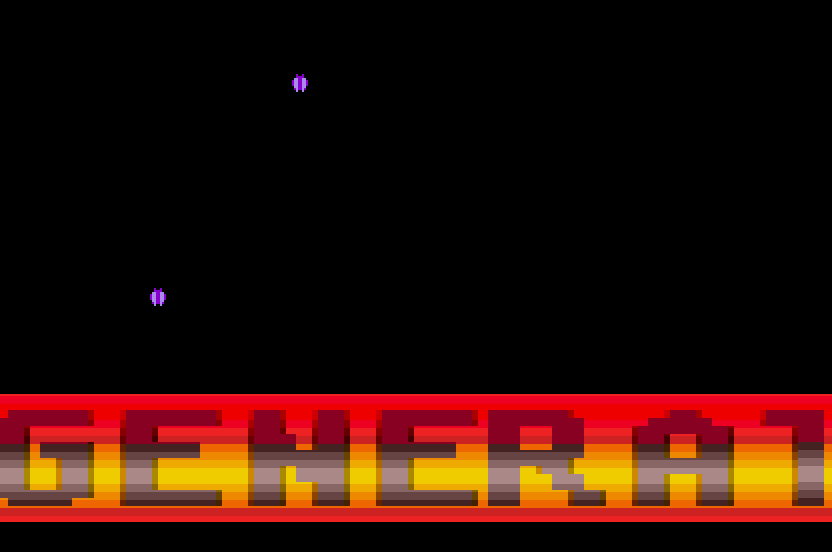

# Lockstep

**Cycle-exact tooling for full-sync Atari ST code.** You declare where the immovable hardware events
belong and what work you want run; Lockstep counts the cycles, sizes the filler, packs your effect
into the gaps, and then proves the result in a cycle-exact emulator.

📖 **Documentation and devlog: [tcriess.github.io/lockstep](https://tcriess.github.io/lockstep/)**



## The problem

On an Atari ST, every scanline is exactly **512 CPU cycles**, and opening a border means landing a
two-byte write on an exact cycle inside them — on every line, of every frame. Miss by four cycles and
the border shuts; worse, the miss carries down and walks the rest of the frame out of alignment.

Traditionally you get there by counting on paper and padding with `dcb.w 90,$4e71` — ninety `nop`s,
because 376 − 16 = 360 and 360 ÷ 4 = 90. Add one instruction anywhere on that line and every filler
count after it is wrong. Then do it for 260 lines.

Lockstep does the counting:

```asm
;@template allborders 512
;@peg 0 left                 ; left border: mono/lo-res flip
    move.b d3,(a1)
    move.b d4,(a1)
;@peg 376 right              ; right border: 60/50 Hz toggle
    move.b d4,(a0)
    move.b d3,(a0)
;@peg 444 extra
    move.b d3,(a1)
    nop
    move.b d4,(a1)
;@endtemplate

;@work repeat=39             ; your effect — poured into the gaps between the pegs
    move.l 8(a6),(a6)+
    addq #4,a6
;@endwork

;@schedule allborders lines=227
```

```
python -m lockstep schedule scroller.src.s -o scroller.s
```

You state the cycle each hardware event lands on — a fact about the video chip, which you have to know
anyway — and the `dcb.w 90` / `13` / `12` fall out. No magic numbers to recompute when the effect
changes.

## What's in the box

- **A cost model that is right, not rounded.** The 68000 shares one memory bus on a four-cycle beat,
  so an instruction's true cost depends on where in that beat it starts. Two `exg` cost **14** cycles,
  not the 16 that round-to-four predicts — and 4 cycles is a `nop`, which is the difference between a
  512-cycle line and a broken picture.
- **A packer.** Declare pegs and work; get an unrolled routine where every scanline is exactly 512c.
- **An overscan frame.** `OverscanFrame` opens **all four borders on all four wakestates** on a plain
  STF, in pure lock-once full-sync — no HBL, no `stop`.
- **A frame budget.** The per-line check can't see the post-display tail; this one can, and fails the
  build before the emulator is launched.
- **An oracle.** Every guarantee ends in a headless, cycle-exact Hatari run. "The borders opened" is a
  measurement, not a mood:

```
overscan matrix — wakestates × borders  (frames 320..322, 3 consecutive)
        left     right    top      bottom
  ws1   open     open     open     open
  ws2   open     open     open     open
  ws3   open     open     open     open
  ws4   open     open     open     open
  => ALL borders open on all wakestates, no flicker
```

## Quick start

```bash
git clone https://github.com/tcriess/lockstep && cd lockstep

python -m st68k annotate  myfile.s          # per-line + running cycle counts
python -m st68k build     line.src.s -o line.s   # turn ;@pad/;@budget intent into exact filler
python -m lockstep schedule scr.src.s -o scr.s   # pack work around the border pegs
python -m lockstep verify  scr.src.s        # confirm every line is 512c, in Hatari

make                                        # build the examples (.TOS)
hatari examples/aurora/aurora.tos           # ...and run the capstone
```

The whole pipeline, in Python:

```python
from lockstep.skeleton import OverscanFrame
from lockstep.budget import assert_within_budget
from lockstep.wakestate import verify_overscan

frame = OverscanFrame()                       # all four borders, all four wakestates
assert_within_budget(frame, tail=my_tail)     # fails the build if the tail overruns the frame
frame.build("DEMO.TOS", setup=my_setup, upper=my_effect, tail=my_tail)

report = verify_overscan("DEMO.TOS", wakestates=(1, 2, 3, 4), frames=range(320, 323))
print(report.matrix())
assert report.ok                              # the single bit you gate a release on
```

## Requirements

| for | you need |
|---|---|
| the cycle engine + scheduler | Python 3.10+, no dependencies |
| the Hatari oracle (`measure`, `verify`, building `.TOS`) | [`vasm`](http://sun.hasenbraten.de/vasm/) (`vasmm68k_mot`) and a cycle-exact [Hatari](https://hatari.tuxfamily.org/) + a TOS/EmuTOS ROM |
| pixel-level border verification (`verify_overscan`) | Pillow, numpy |

Override tool discovery with the `STCYC_VASM`, `STCYC_HATARI` and `STCYC_TOS` environment variables.

## Layout

```
lockstep/        the scheduler and the overscan layer
                   packer.py     pour work into the gaps, size the filler
                   skeleton.py   OverscanFrame — the four-border frame as an object
                   budget.py     the frame's slack, costed before Hatari runs
                   wakestate.py  the ws x border matrix — the pixel proof
                   verify.py     every line is 512c — the cycle gate
                   effects.py    the active-zone lint (absolute writes tear)
                   sound.py      profile a replay's worst-case tick
st68k/           the cycle engine and the Hatari oracle (the `stcyc` CLI)
examples/        bordopen (the minimal four-border demo), aurora (the capstone)
tests/
tools/           a Pygments lexer for 68k asm (used by the docs site)
docs/            tutorial, overscan how-to, design notes, and the devlog
```

## Documentation

Everything below is published as a site — rendered, searchable, cross-linked, with the devlog as a
blog: **[tcriess.github.io/lockstep](https://tcriess.github.io/lockstep/)**. The links here go to the
Markdown sources in this repo, which say the same thing.

- **[Tutorial](docs/TUTORIAL.md)** — the practical guide: the cycle engine, the `;@` directives, the
  scheduler, the oracle.
- **[Opening the borders](docs/HOWTO_OVERSCAN.md)** — the overscan recipe end to end.
- **[Racing the Beam](docs/blog/index.md)** — a six-post devlog on why this is hard and how the
  toolkit came about. Start here if you want the *why*.
- **[Design](docs/DESIGN.md)** / **[ST timing reference](docs/TIMING.md)** — the architecture, and the
  hardware model it rests on.

## Status

The cycle engine, the directive preprocessor, the scheduler, the overscan layer and the Hatari oracle
are all in use. The acceptance test was rebuilding a known-good demo — a shipped 4kb intro — through
the toolkit, with every cycle number its author had counted by hand deleted and re-derived: the
`dcb.w 90 / 13 / 12` on each border line, and the nine `dcb.w` pads balancing the conditionals in its
VBL preamble. The tool re-derives all of them, every scanline measures exactly 512c on cycle-exact
silicon, and the result comes out **pixel-identical to the original** — on all four wakestates, which
the original itself does not manage. See [the capstone](docs/AURORA.md).

`python -m pytest` — **113 passing** (~4m35s; 100 of them are static and run in ~13s). The tests
that drive a real emulator are marked `@pytest.mark.hatari` and are *skipped*, visibly, when Hatari or
a TOS ROM is absent:

```
$ python -m pytest -q          # with the oracle
113 passed in 275s

$ python -m pytest -q          # without it
100 passed, 13 skipped in 13s
```
