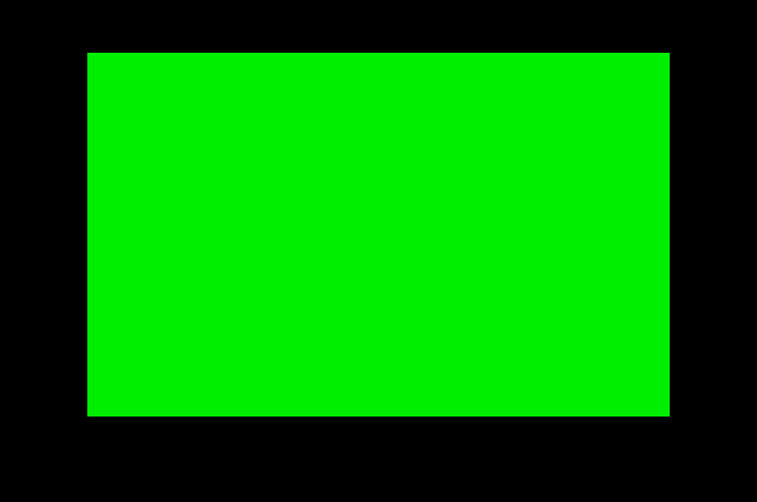
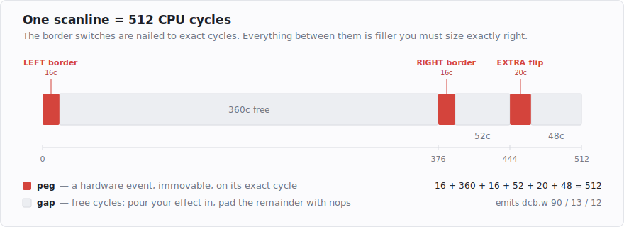

# The 320×200 lie: what full-overscan really costs

The plan sounds simple: the Atari ST draws a 320×200 screen, and I wanted the borders open so it
draws into the surrounding area instead. It turns out "simple" is carrying a lot of weight in that
sentence. This is the first of a short series about building a full-overscan intro on a plain ST,
and about the little toolkit I ended up writing because doing it by hand a second time was not
appealing.

<!-- more -->

Here is the whole objective, in two pictures. Same machine, same low-res 16-colour mode, same green
screen memory. The only difference is *when* a couple of hardware registers get written.

| borders closed | borders open |
|---|---|
|  |  |

Both of those are real frames, rendered by a cycle-exact emulator from an assembled binary — I'll
come back at the end of the series to how they're produced on demand, because "the borders opened"
turning into a *measurement* is half the point of the toolkit.

None of the border-opening itself is new. People have been doing it since these machines were
current — it's one of the oldest tricks in the demo repertoire, and it isn't even Atari-specific;
similar approaches exist for other home computers of the era, wherever a video chip decides the edge
of the picture on a schedule you can interfere with. What this series is actually about is the
full-overscan version on a *plain* ST, made to work on every machine variant, and the tooling that
keeps the cycle-counting out of my hands.

## What the borders are

The ST has a few display modes, and demos almost always use **low resolution: 320×200 with 16
colours**. The machine can also do 640×200 in four colours or 640×400 in monochrome, but those trade
away the palette, and for demos the colours are the point — so 320×200 it is. That 320×200 picture
sits in the middle of the screen, and around it is a blank frame — the **border**. It's not empty
because the tube can't reach there; it's empty because the machine chooses to blank it. Home
computers of that era generally did the same, partly to hide the messy edges of an analog display,
partly because the designers picked a comfortable size and drew a frame around it.

The area the border covers is called the **overscan**. If you can convince the hardware not to blank
it, the picture spills out into that overscan and you get a noticeably bigger image. With all four
borders open, the 320×200 display grows to roughly **416×273** — the same low-res, full-colour mode,
just filling far more of the tube: from about 56% of the visible screen area to about 97% of it.
Nearly double the picture, same palette, and it looks great, which is why demos have chased it for
decades.

So how do you talk the machine out of drawing the border?

## A border is a decision, made every line

Two chips matter here. The **shifter** is the part that reads screen memory and turns it into a
stream of pixels. The **GLUE** is the part that generates the video sync — it decides, among other
things, where each horizontal line ends and where the whole frame ends. The border exists because,
at a fixed point in every scanline, the GLUE tells the shifter "stop, blank now."

How does the GLUE decide *when* to blank? It watches the beam sweep across the line (and down the
screen) and compares its position against a fixed cutoff: "when the beam reaches *here*, stop." The
important part is that the cutoff isn't one fixed number — it depends on a couple of mode registers.
One selects **50 Hz versus 60 Hz** video (the European vs American TV standards; a 60 Hz screen is a
little shorter, and the GLUE keeps a *different* blank-here position for each). Another selects **low
versus high resolution**, which changes the horizontal timing the same way. Normally you set these
once at boot and the cutoffs never move, so the border is always in the same place.

The trick is that you can change a mode register *in the middle of a frame*. The two registers live
at fixed addresses, and writing them is completely unremarkable — this is the entire right-border
switch:

```asm
    move.b  d4,(a0)         ; a0 -> $ffff820a (sync mode), d4 = 0  -> 60 Hz
    move.b  d3,(a0)         ; d3 = 2                               -> back to 50 Hz
```

Two instructions, eight cycles each. Say you're running 50 Hz, whose "blank now" cutoff sits at some
cycle of the line. Flip to 60 Hz a hair before that cycle: now the GLUE is checking for the 60 Hz
cutoff, which is at a *different* position — so the moment where it would have blanked for 50 Hz
slips past unnoticed, and by the time you flip back, the 60 Hz moment has passed too. The beam has
sailed past the point where it should have stopped, the GLUE never gave the "stop" signal, and the
shifter simply keeps drawing — into the border. The left border opens the same way using the
resolution register (`$ffff8260`) instead of the frequency one; the top and bottom borders are the
same idea applied to the *frame's* end instead of the line's. Do it in the right place and the border
you targeted stays open.

That's the whole idea, and stated like that it sounds almost easy. The hard part is hiding inside "a
hair before that cycle."

## The 512-cycle scanline

Time on the ST is measured in CPU **cycles** — single ticks of the processor clock. The 68000 in an
ST runs at 8 MHz, which is eight million of those ticks every second. Every instruction takes a known
number of them: a `nop` (do nothing) is four cycles, a `move.b` to a hardware register is eight, a
multiply is dozens.

Now line the clock up with the screen. The picture is redrawn 50 times a second (that's the 50 Hz
again), and each redraw is a stack of 313 scanlines drawn top to bottom. Eight million ticks, divided
across 50 frames of 313 lines each, comes out to about **512 cycles per scanline**. That number is the
spine of everything that follows, so it's worth sitting with: from the moment the beam starts drawing
one line to the moment it starts the next, the CPU has executed exactly 512 cycles' worth of
instructions — no more, no less. Whatever you want done during a line, it has to fit in those 512
ticks, and it has to leave the border-switch write sitting on its exact tick.

So a scanline of a full-overscan frame looks like this — three immovable hardware events at fixed
cycle offsets, and the cycles in between are yours:



(One thing to file away, because it's the first question people ask: that 8 MHz clock is *fixed*. The
50/60 Hz switch we'll use to open borders is a video setting — it never changes how fast the CPU runs,
so it can't make the code shorter. Whether flipping it changes the *line's* length is a fair question
with a satisfying answer, and I'll come back to it once the switches are concrete.)

To hold a border open you have to land that two-byte write on a specific cycle of those 512 — for the
right border, cycle 376 — and you have to do it on *every line* that should have an open border. Not
"about 376." 376. If the write lands even a little late, the GLUE has already read the old value and
blanked the line, and that line snaps back to 320 pixels.

And it gets worse, because the lines aren't independent. If a write lands late, the CPU is now a few
cycles out of step with the beam for everything after it. The next line's border write is now also
mistimed, and the one after that. A single missed write doesn't spoil one line — it walks the rest
of the frame out of alignment. You don't get a small glitch; you get garbage from that point down.

## Why this needs counting, and why I stopped counting by hand

Put those two facts together — every scanline is exactly 512 cycles, and every border write must hit
an exact cycle — and you arrive at the defining constraint of this kind of code: **every scanline has
to be padded to exactly 512 cycles**, with the border writes at their exact offsets, or the picture
falls apart.

In practice that means filling the gaps between the useful work with precisely the right number of
do-nothing instructions. On the 68000 the classic filler is `dcb.w n,$4e71` — *n* copies of `nop`,
four cycles each. Here is one real scanline of a full-overscan frame, in the traditional style:

```asm
; ---- one scanline: 512 cycles, no more, no less ----
    move.b  d3,(a1)         ;   8c   left border: flip to hi-res...
    move.b  d4,(a1)         ;   8c   ...and straight back to lo-res
    dcb.w   90,$4e71        ; 360c   90 nops.
    move.b  d4,(a0)         ;   8c   right border: 60 Hz, on cycle 376
    move.b  d3,(a0)         ;   8c   back to 50 Hz
    dcb.w   13,$4e71        ;  52c   13 nops.
    move.b  d3,(a1)         ;   8c   extra left flip, on cycle 444
    nop                     ;   4c
    move.b  d4,(a1)         ;   8c
    dcb.w   12,$4e71        ;  48c   12 nops, and the line closes on exactly 512.
```

Look at those filler counts: 90, 13, 12. Nobody chose them. They're what's *left over*. The left
switch costs 16 cycles, the right one has to start at 376, so the gap is 376 − 16 = 360 cycles, and
360 ÷ 4 = 90 nops. Then 444 − 392 = 52, so 13 nops. Then 512 − 464 = 48, so 12 nops. Real full-sync
source is littered with lines like that, each with a hand-written comment, each number the output of
a little subtraction the author did on paper.

And every one of them is load-bearing. Add a single instruction anywhere in that line — one more
`move.w` for your effect — and *every* filler count after it is wrong, and you recount them. Do that
for 260 lines.

I did that for a whole demo once. It works, but it's bookkeeping, and bookkeeping is what computers
are for. So the tool this series is really about starts from a small idea: describe *where* the
immovable border events are and *what* work you want to run, and let a program add up the cycles and
size the filler. Which, jumping ahead, looks like this:

```asm
;@template allborders 512
;@peg 0 left                 ; the left-border flip belongs at cycle 0
    move.b d3,(a1)
    move.b d4,(a1)
;@peg 376 right              ; the right-border flip belongs at cycle 376
    move.b d4,(a0)
    move.b d3,(a0)
;@peg 444 extra
    move.b d3,(a1)
    nop
    move.b d4,(a1)
;@endtemplate

;@schedule allborders lines=227
```

No 90. No 13. No 12. You state the cycle each hardware event must land on — which is a fact about the
machine, and which you have to know anyway — and the numbers fall out. Feed that through the tool and
it emits the exact `dcb.w 90` / `dcb.w 13` / `dcb.w 12` from the listing above, 227 times over. The
human declares intent; the machine counts.

## Two ways to hit it

Before going further I should be honest that this counting route isn't the only one. There are broadly
two ways to make these timings, and it's worth knowing both.

The route this series takes is **full-sync**: put the whole frame in one place, switch the interrupts
off, and count every cycle so each scanline lands on its 512 exactly. It's the demanding option —
nothing re-synchronises you, so a four-cycle miscount stays four cycles wrong all the way down the
frame — but it's the pure one, with no interrupt overhead eating the cycles you'd rather spend on the
effect.

The alternative leans on the hardware to re-sync you. Besides the vertical blank between frames, there
is a **horizontal blank** interrupt — the HBL — that fires at the *start of every scanline*. Let it,
and an HBL handler runs once per line and can do the border switches right there, anchored to the line
boundary by the interrupt instead of by a cycle count carried down from the top of the frame. That
eases the hunt for the timing considerably: each line re-anchors itself, so a miscount on one line
doesn't compound into the next. The price is the interrupt's own cost and its timing jitter, and
giving up "pure" full-sync. Both approaches are old and both are legitimate; I went full-sync because
I wanted the cycles, and because once a tool is doing the counting the main reason to avoid it goes
away. (The HBL comes back a few posts from now, as a way to re-lock the frame — I tried it, it
flickered, and that's a story for later.) Either way the truth from this post stands: there is no
"close enough."

**Takeaway:** overscan isn't a feature you switch on. It's a timing you hit — 512 cycles per line,
the border write on its exact cycle — every line, every frame. Next: the same binary, four different
machines, and why "it works on my ST" means almost nothing.
