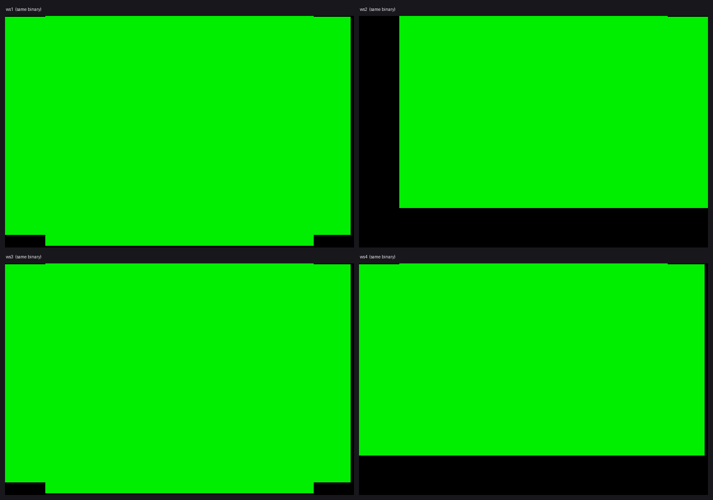
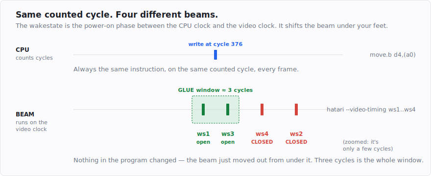

# Same code, half your STs: wakestates and owning the machine

In the [first post](post-1-the-320x200-lie.md) the problem was hitting an exact cycle on every
scanline. This post is about two nastier surprises that come after you've done that: the same binary
behaving differently on different machines, and a demo that runs perfectly until someone touches the
mouse.

<!-- more -->

## The wakestate lottery

I had all four borders open and a screenshot to prove it. Then I changed one setting in the emulator
and half the borders were shut — same binary, same code, nothing touched but a flag called the
**wakestate**.

Here is what that actually looks like. One binary, four runs, nothing different but a command-line
flag:



Look at ws2: a fat black bar down the left-hand side and another along the bottom. Two borders that
were open a moment ago simply aren't. On ws4 the bottom is gone. On ws1 and ws3 everything is fine.
The code is identical in all four.

A wakestate is a phase relationship. The ST has a CPU running at 8 MHz and video hardware running off
its own clock, and when you switch the machine on, those two clocks settle into one of four fixed
relative offsets. Which one you get is decided by the analog noise of the power-on moment, and it
stays fixed for the whole session. On real hardware you can't choose it; in the Hatari emulator you
select it:

```
hatari --video-timing ws1 bordopen.tos      # ...through ws4
```

Nothing is wrong with the program. It is correct — for wakestate 3, which happens to be the one my
machine powered up in while I was writing it.

To see why that's fatal, remember what a border switch actually is. From the last post: opening a
border means flipping a mode register at the exact cycle the GLUE checks its "blank now" cutoff — so
narrow that the useful window is only about two or three cycles wide. My code flips the register on a
particular cycle, counted from the start of the frame. That counting is done by the CPU, in CPU cycles.

But whether the flip *lands* in the window depends on where the **beam** is when it happens, and the
beam runs off the video clock, not the CPU clock. The wakestate is exactly the offset between those two
clocks:



So when I count "flip on cycle 376," the beam is at one place on ws3 and a few cycles further along on
ws2 — the CPU thinks it's on time, but relative to the beam it's late. On the wakestate I developed on,
the flip lands dead-centre in the two-or-three-cycle window. On another, the same counted flip lands
three cycles later against the beam, and three cycles is the whole window. It misses, the GLUE blanks
the line, the border closes. Nothing in the program changed; the beam just moved out from under it. I
hadn't written a demo — I'd written a demo for one wakestate, and I didn't know it.

(This is also why a small mistake anywhere before the switch is unforgivable: shift the *count* by a
few cycles and you get the same miss, on every wakestate. The whole frame is one budget measured in
cycles, and the border switches are three-cycle windows floating in it.)

## Making it a test, not a vibe

The picture above is nice, but four screenshots I have to *look* at is not a check — it's a chore I
will skip on a Friday. So the first thing the toolkit grew was a way to ask the question mechanically:
build the binary, run it headless at each wakestate, look at the actual pixels in the overscan, and
report a table.

```python
from lockstep.wakestate import verify_overscan

report = verify_overscan("bordopen.tos", wakestates=(1, 2, 3, 4), frames=range(320, 323))
print(report.matrix())
print("ship it" if report.ok else "DO NOT SHIP")
```

which is the same four runs, without me squinting at anything:

```
overscan matrix — wakestates × borders  (frames 320..322, 3 consecutive)
        left     right    top      bottom
  ws1   open     open     open     open
  ws2   CLOSED   open     open     CLOSED    <- FAIL
  ws3   open     open     open     open
  ws4   open     open     open     CLOSED    <- FAIL
  => FAIL — see above
```

It works by measuring the fill of each outer overscan band against the border colour: a closed border
reads about 0.00, an open one 0.6 and up. `report.ok` is the single bit you gate a release on. (There
is a third status besides `open` and `CLOSED`, and it cost me several days — but that's the next post's
story.)

## The easy way out: call it an STE demo

There is an escape hatch, and I took it last time. The Atari ST came in two broad generations: the
original **STF**, and the later **STE**, which added a blitter (a block-copy chip) and stereo sample
sound, and — crucially here — reworked video timing. The STE does not have the wakestate lottery: its
video hardware settles the same way every time, so a border trick that opens on one STE opens on all
of them. My previous demo simply declared itself an STE production, and the problem disappeared.

That's a legitimate choice, but it bothered me. Most people with an Atari have the plain STF, and
"STE only" is a way of not solving the problem. So the whole point of the toolkit — and of this
series — is the harder version: open all four borders on a plain STF, on all four wakestates, from a
single binary. That turns out to be possible with careful, counted placement, and I'll spend a later
post on exactly how. For now the lesson is the uncomfortable one:

> "Works on my ST" is a sample size of one wakestate. There are four. You test all of them, or you've
> tested nothing.

## The headless mirage

The second surprise was more embarrassing. A build ran flawlessly for me — in the emulator, headless,
a hundred frames sampled, not a pixel of drift — and fell over the moment I sent it to someone who
ran it and moved the mouse.

To see why, you need one more piece of the machine: **interrupts**. An interrupt is the hardware
stopping the CPU mid-program to run a short handler, then resuming. The ST uses them constantly. Two
matter here. The **VBL** (vertical blank) interrupt fires once per frame, in the gap where the beam
travels back to the top of the screen; it's the natural heartbeat a demo synchronises to. And the
**MFP** — the Multi-Function Peripheral, a support chip — runs several timers and handles the serial
line. One of its timers, **Timer C**, ticks 200 times a second to drive the operating system's clock.
The keyboard and mouse talk to the machine through a serial chip (the **ACIA**), and every time they
have something to say, that too fires an interrupt.

Headless, there's no keyboard and no mouse, so none of that serial traffic happens and the frame runs
undisturbed. On a real machine, the moment the mouse moves, the ACIA fires — and it fires at a higher
priority than the VBL. Interrupts have levels; the VBL is level 4, the keyboard/mouse ACIA is level 6,
and level 6 preempts level 4. So the mouse handler barges into the middle of my carefully counted
frame, runs its few dozen cycles, and hands the CPU back late. Every border write after that point is
now mistimed, and — as we established last time — a single late write walks the rest of the frame.
Timer C's 200 Hz tick does the same thing, quietly, even without input.

## Owning the machine

The obvious fix is to slam the door: mask all interrupts with `move #$2700,sr` and let nothing
through. Do that and the borders close — because the VBL is an interrupt too, and it's the heartbeat
the GLUE relies on to keep the frame's timing coherent. Mask everything and you've killed the one
interrupt you need.

The working answer is surgical instead of blunt. You leave the VBL firing, but you disable *all* the
MFP interrupts at their source, so Timer C's tick and the ACIA's mouse jitter never reach the CPU at
all. That's two `clr.b`s:

```asm
    move.b  $fffffa13,__imra    ; save MFP interrupt-mask register A (to restore on exit)
    move.b  $fffffa15,__imrb    ; ... and B
    clr.b   $fffffa13           ; disable ALL MFP channel-A interrupts
    clr.b   $fffffa15           ; disable ALL channel-B: Timer C's 200 Hz tick AND the
                                ;   keyboard/mouse ACIA — the level-6 interrupt that would
                                ;   otherwise preempt the level-4 VBL and walk the border
                                ;   switches off-cycle.
```

Then you put your entire frame *inside* the VBL handler — so it starts already synced to the top of
the picture — and park the main program in a harmless operating-system call where it can't do
anything:

```asm
    move.l  #__vbl,$70.w        ; install the whole frame as the $70 VBL handler
__wait:
    move.w  #7,-(sp)            ; Crawcin() — block in the OS, do nothing, touch nothing
    trap    #1
    addq.l  #2,sp
```

Nothing gets a cycle you didn't grant it. The toolkit now bakes this whole bootstrap into every build
— `emit_program()` wraps your frame in it, saves the palette, resolution, sync mode and MFP masks on
the way in, and restores them all on the way out — so it isn't something you can forget to do.

Stated plainly: a full-sync frame cannot afford one uninvited cycle, and half the work of full-sync is
making sure nothing else is allowed to speak. Get the bootstrap right and the machine is yours for the
whole frame.

**Takeaway:** test all four wakestates (or target the STE and admit it), and own the machine so no
timer or mouse gets a cycle. Next: the toolkit itself — describing a scanline as pegs and gaps, and
letting the emulator, not your eye, tell you the borders opened.
