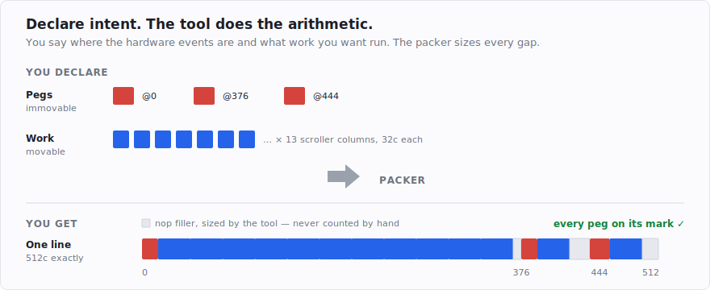

# Pegs, budgets, and an oracle: the toolkit

The [first two posts](post-1-the-320x200-lie.md) were about the problem: every scanline is exactly
512 CPU cycles, the border switches have to land on exact cycles, and the machine has to be yours for
the whole frame. This post is about the tool I built so I didn't have to solve that with a pencil.

<!-- more -->

## The thing I was tired of

Full-sync code is full of padding. Between the instructions that do real work you insert do-nothing
instructions to fill the line out to exactly 512 cycles, with the border switches at their fixed
offsets. Post 1 had the canonical scanline: `dcb.w 90,$4e71`, then the right-border flip, then
`dcb.w 13`, then `dcb.w 12`, and the line closes on 512.

The numbers 90, 13 and 12 are not choices. They're subtractions. And they are *coupled*: add one
`move.w` to the effect running on that line and the first count drops from 90 to 84, which changes
nothing else — until you add an instruction that isn't a multiple of four cycles, and then the whole
line has to be re-derived. Now do that for 260 lines, each with different work on it.

After one demo of that, I wanted the computer to do the counting.

## Pegs and gaps

The tool's model is small. You describe a scanline as two things:

- **Pegs** — the immovable hardware events, each nailed to a cycle. The left-border switch is a peg at
  cycle 0, the right-border switch a peg at 376, an extra left flip at 444. A peg is "this exact
  instruction, at this exact cycle, no argument."
- **Work** — the effect logic you want to run: shifting a scroller, plotting, whatever. This is
  movable; it just has to fit somewhere.

Then a routine called the **packer** pours the work into the **gaps** between the pegs and sizes the
`nop` filler itself, so the line comes out to exactly 512 cycles with every peg on its mark.



In practice you write that as a spec. This is the whole of `allbord.s` — a real file in the repo:

```asm
;@template allborders 512
;@peg 0 left                 ; left border: mono/lo-res flip
    move.b d3,(a1)
    move.b d4,(a1)
;@peg 376 right              ; right border: 60/50 Hz toggle
    move.b d4,(a0)
    move.b d3,(a0)
;@peg 444 extra              ; extra left flip
    move.b d3,(a1)
    nop
    move.b d4,(a1)
;@endtemplate

;@schedule allborders lines=227
```

Note what is *not* in there: any number that has to be recomputed when something changes. You state
the cycle each hardware event lands on — a fact about the GLUE, not about your code — and the offsets
of nothing else. Then:

```
python -m lockstep schedule examples/aurora/allbord.s -o allbord.s
```

and out comes the assembly, 227 scanlines of it, each annotated with where its filler came from:

```asm
; === lockstep: allborders x227 lines (0/0 work units) ===
;@budget 512    ; --- scanline 0 ---
    ; peg @ 0c: left ; left border: mono/lo-res flip
;@pad 0
    move.b d3,(a1)
    move.b d4,(a1)
    ; peg @ 376c: right ; right border: 60/50 Hz toggle
;@pad 376
    dcb.w 90,$4e71  ; @pad 376: +360c
    move.b d4,(a0)
    move.b d3,(a0)
    ; peg @ 444c: extra ; extra left flip
;@pad 444
    dcb.w 13,$4e71  ; @pad 444: +52c
    move.b d3,(a1)
    nop
    move.b d4,(a1)
;@fill
    dcb.w 12,$4e71  ; @fill -> budget 512: +48c
;@end
```

`dcb.w 90`, `dcb.w 13`, `dcb.w 12` — the same three numbers from post 1, derived from the peg offsets
instead of counted by hand. You stop writing filler counts and start declaring intent.

Adding the actual effect is the other half of the declaration. Work is just a block of instructions and
a count of how many times it goes in:

```asm
;@work repeat=39             ; the scroller feed: 39 atomic "column" blocks
    move.l 8(a6),(a6)+
    addq #4,a6
;@endwork

;@schedule allborders lines=3
```

The packer fits eleven of those columns into the 360-cycle gap before the right-border flip, one into
the 52-cycle gap after it, one more into the tail, and shrinks the `dcb.w` filler to match. If the work
doesn't fit, it says so and fails the build; it never quietly drops a block or mis-sizes a gap.

There's a Python API underneath, which is what you actually use once the effect itself is generated
rather than typed:

```python
from lockstep import LineTemplate, Peg, WorkStream, pack

ALLBORDERS = LineTemplate([
    Peg(0,   "move.b d3,(a1)\nmove.b d4,(a1)",      "left"),
    Peg(376, "move.b d4,(a0)\nmove.b d3,(a0)",      "right"),
    Peg(444, "move.b d3,(a1)\nnop\nmove.b d4,(a1)", "extra"),
])

work = WorkStream.repeat("move.l 8(a6),(a6)+\naddq #4,a6", n=39)
res  = pack(ALLBORDERS, work, n_lines=3)
print(res.asm)               # the unrolled, 512c-per-line routine
```

That's the entire model. (The [tutorial](../../TUTORIAL.md) has the rest of the vocabulary — splittable
work blocks, beam windows, multi-band screens, and a solver that picks a mix of `move.l`/`move.w` to
fill a gap with *useful* shifting where nops would otherwise go.)

For any of this to be trustworthy, the cost of each instruction has to be *right*, not guessed — and on
the ST that is subtler than it sounds.

## The four-cycle beat

Everything in the machine — the CPU fetching instructions, the CPU reading and writing memory, the
shifter fetching pixels — shares one memory bus, and that bus is handed out on a strict four-cycle
beat. You can only start a memory access on the beat; if your instruction is ready to touch memory half
a beat early, it waits. So an instruction's real cost isn't a fixed property of the instruction — it
depends on *where in the four-cycle beat it happens to start*, which depends on everything that ran
before it.

The naive rule everyone reaches for first is "take the 68000's book cycle count and round it up to a
multiple of four." It is wrong, and you can watch it be wrong. Take two `exg` instructions — the book
says six cycles each:

```asm
    exg d0,d1
    exg d0,d1
```

Round-to-four says 8 + 8 = **16 cycles**. Ask the emulator what actually happens:

```
$ python -m st68k measure chunk.s
Hatari (cycle-exact): 14c
static estimate:      14c   -> MATCH
beam:                 line 269 cyc 484 -> line 269 cyc 498
```

**Fourteen.** The first `exg`'s odd sixth cycle leaves the bus half a beat out of step, and the second
one slots into that gap rather than waiting for a fresh beat. Round-to-four over-counts by four cycles
— and four cycles is a `nop`, which is to say it's the difference between a line that's 512 and a line
that isn't.

So the tool doesn't round. It carries a little model of that four-cycle beat — a bus-phase accumulator,
if you want the term — threading the running phase from instruction to instruction the way the real
hardware does. That's the `static estimate: 14c -> MATCH` line above: the model and the silicon agree.
(You can ask for the naive model with `--round4`, and it dutifully reports 16c. It's there so you can
see the gap.)

Which raises the obvious question: how do I know the model matches reality in general, and not just on
the examples I checked?

## The emulator as an oracle

You measure. "The borders are open" and "this line is 512 cycles" need to be measurements, or they're
just a good mood.

The tool for that is **Hatari**, an Atari emulator with a *cycle-exact* mode — it models the machine
tightly enough that its cycle counts and its rendered picture match real hardware for this kind of
code. You can run it headless, drive it from a script, drop markers in the code and read back how many
cycles elapsed between them and where the beam was. So every guarantee the tool makes ends in a
headless Hatari run, not an assertion:

```
$ python -m lockstep verify examples/aurora/allbord.s
# template allborders x227
lockstep verify: 227 line(s)
  line   0:  512c  ok    (enters at HBL 110, line-cycle 300)
  line   1:  512c  ok    (enters at HBL 111, line-cycle 300)
  line   2:  512c  ok    (enters at HBL 112, line-cycle 300)
  ...
  line 226:  512c  ok    (enters at HBL 23, line-cycle 300)
  => ALL LINES on budget — borders hold
```

Every line: 512 cycles, and every line entered at the same intra-line cycle (300) — that constant is
the frame staying in step with the beam, line after line, which is exactly the property the borders
depend on.

The static model gives you a number instantly, at build time. The oracle confirms it on the actual
assembled bytes. Two independent yardsticks, and when they disagree the tool tells you rather than
shipping.

Two things bit me here, and both are worth passing on because neither is obvious.

**The vertical-blank counter lies once the bottom border is open.** The usual way to grab a settled
frame from the emulator is "wait until frame number N" — the machine counts frames using the vertical
blank, the interrupt that fires in the gap between frames. But opening the bottom border works by
convincing the hardware the frame isn't over yet… which means there's no vertical blank to count. The
frame counter stops advancing, and "wait for frame N" waits forever — or worse, fires immediately on a
stale value and screenshots the desktop. The fix is to have the demo bump its own counter each frame
and trigger on that instead. (Every screenshot in this series is taken that way.)

**A strided automated check can't see a flicker.** This one is almost embarrassing, because the flicker
itself was completely obvious — the moment the demo actually ran on screen, the border was blinking on
every other frame, plain as day. What missed it was my *automated* check. To confirm a build quickly
across all four wakestates I was grabbing a screenshot every fiftieth frame and checking they matched;
they did, and I called it rock-steady. Fifty is even, so I was always landing on the same phase of a
two-frame flicker and the other phase never showed up in my sample. Just watching it run would have
caught it in a second — trusting a strided automated sample hid it for days.

The fix went straight into the tool. The border check samples *consecutive* frames, so it cannot alias
past a period-2 flicker, and `flicker` is a first-class verdict alongside `open` and `CLOSED`:

```python
verify_overscan("bordws.tos", wakestates=(1, 2, 3, 4), frames=range(320, 323))
```

```
overscan matrix — wakestates × borders  (frames 320..322, 3 consecutive)
        left     right    top      bottom
  ws2   open     open     open     FLICKER   <- FAIL
```

A tool that reports a flickering border as "open" is worse than no tool, because it launders a bug into
a green tick.

## What this buys

Two questions I used to answer by staring — "is every line 512 cycles?" and "did the borders actually
open?" — became commands. The first is a fast static check plus a headless cycle measurement; the
second is a headless screenshot analysed for whether each of the four borders let the picture through,
on every wakestate, across consecutive frames. Cheap to run, honest when it fails, and — most
importantly — run *before* I send anything to anyone.

**Takeaway:** declare the pegs, hand over the work, let the tool count the cycles — and end every
"it's fine" in a measurement of consecutive frames. Next: actually getting all four borders open on a
plain ST, on every wakestate, and why *how* you write a pixel matters as much as when.
