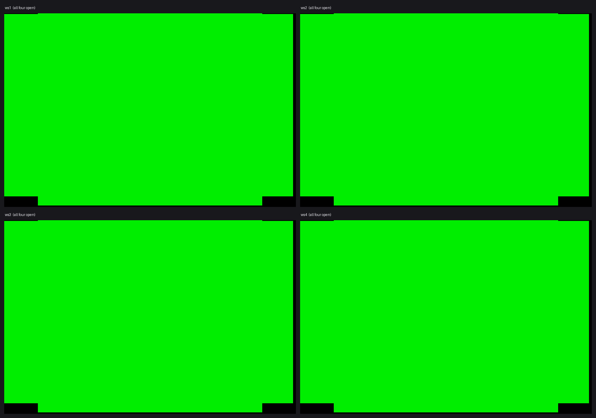
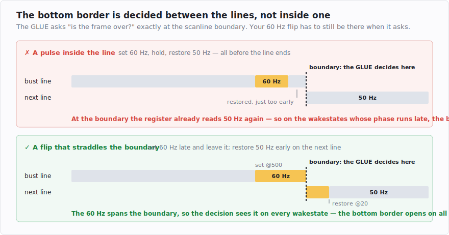

# Opening all four borders, on every wakestate

[Post 2](post-2-same-code-half-your-sts.md) ended on the hard version of the problem: open all four
borders on a plain ST, from one binary, on all four wakestates — the power-on clock phases that slide
the whole frame by a few cycles and shut the borders you'd carefully opened. The easy way out was to
target the STE, which doesn't have that lottery. This post is how you do it the hard way instead.

<!-- more -->

Here's where we're going. Same contact sheet as post 2, same binary run four times, after the three
fixes below:



## Lock the frame once, then count

The first idea most people reach for is to re-synchronise constantly — check the beam position over
and over and nudge the timing back into place. It works, but it burns cycles you don't have and it
isn't actually necessary. If every scanline is genuinely 512 cycles (the tool from the last post
guarantees that), then the frame *stays* in step on its own once it starts in step. You only need to
lock **once per frame**, at the top.

The lock uses a helpful piece of hardware. The chip that feeds screen memory to the display (the MMU,
which walks a pointer through video RAM) exposes that pointer in a register at `$ffff8209`. Because the
pointer advances in lockstep with the beam, reading it tells you where the beam is. So at the top of
each frame the code polls that register until it ticks over, which pins the CPU to the beam:

```asm
    move.w  #$8209,a0           ; the MMU's video-address low byte — advances with the beam
    moveq   #0,d0
.wait:
    move.b  (a0),d0
    beq.s   .wait               ; spin until it goes non-zero
```

But that pins you only *coarsely*. The poll is a loop — read, test, branch back — and a loop only
checks every few cycles, so on any given frame you fall out of it somewhere inside a small window, not
on the same cycle every time. The vertical-blank interrupt that got you here doesn't land on an exact
cycle either. So after the coarse poll you need to shave off however many cycles you happened to
overshoot by — and that amount is different every frame.

This is where the neatest instruction in the whole thing comes in, and it's worth slowing down for:

```asm
    moveq   #16,d1
    ...
    sub.w   d0,d1               ; d1 = 16 - (how far into the window we landed)
    lsl.w   d1,d0               ; shift d0 left by d1 bits — and throw the result away
__lock:                         ; <- every frame arrives here on the same cycle
```

When the poll falls through, the value you just read from the register tells you *how far into the
window you are*. You turn that into a small number — sixteen minus the value — and feed it as the
shift count to a single `lsl.w`. The trick is that on the 68000 a shift *costs more the further it
shifts*: six cycles, plus two per bit. The shifted result is garbage; nobody reads `d0` afterwards.
Only its **duration** matters. A frame where you dropped out of the poll early gets a big shift count
and burns more cycles here; a frame where you dropped out late gets a small count and burns fewer — and
the two exactly cancel. Whatever cycle you came out of the poll on, you come out of `lsl.w` on the
*same* cycle, every frame. One register read, converted into a compensating delay by an instruction
whose cost is the point and whose output is discarded.

After that fine-sync, the 512-cycles-per-line counting keeps everything aligned for the rest of the
frame. One poll, one variable-cost shift, then pure counted code — no interrupts, no re-syncing, no
`stop`.

That single lock, done carefully, opens the top, left and right borders on all four wakestates. The
bottom was the one that fought me.

## The bottom border, and a boundary I'd misunderstood

The reason it's different comes back to what each border *is*. The left and right borders are about
where a **line** starts and ends — a horizontal question the GLUE answers many times per frame, once
for every scanline, at a cutoff *inside* the line. So a register flip placed on the right cycle within
the line catches the check. The top and bottom borders are about where the **picture** starts and ends
— a vertical question, answered by counting whole scanlines: "have we drawn the last visible line
yet?" That check doesn't happen at some cycle in the middle of a line; it happens once per line, right
at the boundary where one scanline ends and the next begins, when the GLUE ticks its line counter and
asks whether the frame is over.

That distinction — a switch aimed *inside* a line, a decision made *between* lines — is the whole
problem, and I didn't see it at first.

My first attempt was a pulse inside the bust line: flip to 60 Hz, hold a few cycles, flip back. That
opens the bottom border on two of the four wakestates and does nothing on the other two. I swept every
knob I had — which line to bust on, how wide the pulse, how long the hold. Nothing moved the failing
wakestates, which is usually a sign the model is wrong rather than the numbers.

It was:



On the wakestates where the phase runs a little differently, my pulse had already flipped *back* to
50 Hz before the machine made its end-of-frame decision at the line boundary. The switch was there; it
just wasn't there **at the boundary**.

The fix follows directly once you see it. Instead of a pulse contained in one line, set 60 Hz late on
the bust line and *don't* flip back — then restore 50 Hz early on the *next* line, before its own
border work. Now the 60 Hz straddles the scanline boundary, so whatever the wakestate's phase, the
decision at the boundary sees 60 Hz. No polling, no retry loop, just two counted writes on two adjacent
lines:

```python
from lockstep.skeleton import OverscanFrame

frame = OverscanFrame(
    main_lines=227,     # the bust lands on exactly the right scanline — a sharp resonance
    left_nops=1,        # the left-border stabiliser: widen the flip 8c -> 12c
    cross=True,         # cross-boundary bottom bust:
    set_off=500,        #   set 60 Hz at cycle 500 of the bust line, and leave it...
    restore_off=20,     #   ...restore 50 Hz at cycle 20 of the NEXT line
)
frame.build("bordws.tos", setup=SETUP)
```

Three ingredients, and all three are needed. `cross=True` is the boundary straddle above. `left_nops=1`
widens the left-border flip by a single extra `nop` — a stabiliser that covers a wider slice of the
wakestate window for the fussy left border, and the thing that fixes ws2's missing left border
specifically. And `main_lines=227` lands the bust on exactly the right scanline; this one is a sharp
resonance, where one specific line count works and its neighbours don't.

Put those together, run the check from post 2, and:

```
overscan matrix — wakestates × borders  (frames 320..322, 3 consecutive)
        left     right    top      bottom
  ws1   open     open     open     open
  ws2   open     open     open     open
  ws3   open     open     open     open
  ws4   open     open     open     open
  => ALL borders open on all wakestates, no flicker
```

That's the contact sheet at the top of the post, as a table. All four borders, all four wakestates, in
pure lock-once full-sync — no HBL, no `stop`.

## But doesn't 60 Hz make the line shorter?

Here's the question I promised in the first post, and it's the sharpest one in the whole topic. A
50 Hz scanline is 512 cycles; a real 60 Hz (NTSC) line is genuinely shorter, 508 cycles — four fewer.
So when I flip to 60 Hz partway through a line, is the beam actually running faster for those few
cycles, and doesn't that eat into the 512 the CPU is counting on?

The answer turns on what "60 Hz" actually does, and it's worth being precise. It does *not* touch the
CPU — that's a fixed 8 MHz whatever the video register says. And it does *not* physically speed the
beam up: the monitor's sweep is analog and can't change on a register write. What it changes is a
single decision inside the GLUE — *where the line is declared over*. Picture a counter inside the GLUE
that ticks up once per cycle, always at the same rate, and a line ends when that counter reaches its
end-of-line value. The 50/60 bit is nothing more than *which* value that is: 512 or 508. The counter
itself never speeds up and never skips a tick; only the finish line moves.

That's the crux, and it's the part the "few faster cycles" picture gets wrong. Line length isn't a
running tally of how fast the beam went cycle by cycle, which a brief 60 Hz burst could shave down —
it's *one comparison*, made once, near the end of the line. The only thing that matters is the
register's value *at that comparison*. A flip at cycle 376 that's restored a few cycles later is long
gone by the time the counter climbs into the 508–512 range, so the counter reaches 512 and the line
ends at 512, same as always. The flip was real and it did its job — it fooled the *display-end*
comparison a few hundred cycles earlier, which is a different decision made at a different count — but
it never touched the end-of-line comparison, so it cost the line exactly nothing. (The cross-boundary
bottom bust plays the same game against yet another decision, the *frame*-end one made at the line
boundary: it's placed to reach that decision without being present when the line's own length is
fixed.)

So the common guess — "the flip is too short to register" — has it backwards. The flip absolutely
registers; that's how the border opens. And the beam never runs faster; the counter just isn't told to
stop early. One footnote for completeness: you *can* deliberately hold 60 Hz *across* the end-of-line
comparison, and then the line genuinely does come out short — 508 cycles, or fewer. The ST scene uses
exactly that for other tricks (the famous "short lines"). It's a real effect; these border switches are
simply placed to avoid it.

And the reassuring part is that none of this has to be taken on trust. Remember the oracle from
[post 3](post-3-pegs-budgets-and-an-oracle.md): the tool measures every single line in the cycle-exact
emulator — the borders-open lines and the bust line included — and every one comes back at exactly 512:

```
lockstep verify: 260 line(s)
  line 226:  512c  ok    (enters at HBL 94, line-cycle 440)
  line 227:  512c  ok    (enters at HBL 95, line-cycle 440)    <- the bust line: 60 Hz set here
  line 228:  512c  ok    (enters at HBL 96, line-cycle 440)    <- and restored here
  line 229:  512c  ok    (enters at HBL 97, line-cycle 440)
  => ALL LINES on budget — borders hold
```

If a flip ever did shorten a line to 508, that measurement would show it at once. The 512 isn't an
assumption I'm hoping holds; it's a number the tool checks on every line.

## The dead end worth mentioning

I spent a while on a fashionable alternative: `stop #$2100`, an instruction that halts the CPU until
the next horizontal-blank interrupt (the HBL, which fires at the start of each scanline). Halting until
a hardware event is appealing because it re-locks the CPU to the video timing precisely, and it does
open the top, left and right borders on every wakestate. But it flickered — every other frame, the
period-2 flicker from the last post. The halt gets you the *coarse* lock but leaves a couple of cycles
of residual jitter, and without a fine-sync on top of it, that jitter lands the top-border switch in a
slightly different place on alternate frames. Since the once-per-frame poll-and-`lsl` already solves all
four wakestates without any of that, the clever halt was simply unnecessary. It stayed in as a
diagnostic and never in the shipping build. Counted, lock-once placement beat the clever interrupt
trick.

## In the active zone, how you write is when you write

One more thing the emulator taught me the expensive way, and it belongs here because it only shows up
once the borders are open and you start drawing into them.

During the visible part of a line the CPU and the shifter share the memory bus — the shifter is busy
fetching the pixels it's about to display, and your writes compete for the same bus slots. It turns out
that two instructions of *identical cycle cost* can behave differently depending on how they touch that
bus:

```asm
    move.w  d0,$a8000       ; absolute address baked into the instruction — TEARS
    move.w  d0,(a3)         ; same cost, same write, through an address register — fine
```

Writing a screen word with an **absolute** address holds the bus in a way that starves the shifter, and
the picture tears. Writing the same word through an **address register** does not. Same cycle count,
different picture.

The border switches are absolute on purpose — those are hardware registers at fixed addresses like
`$ffff820a`, and there's no other way to name them. But everything you write into the *screen* during
the active display has to go through an address register. This isn't in any cycle count; the line can be
a perfect 512 cycles and still tear, because tearing is a bus-contention effect, not a timing one.

So the tool grew a small linter that flags absolute screen writes in active-zone code while leaving the
hardware-register writes alone:

```
$ python -c "from lockstep.effects import active_zone_lint; ..."
line 1: move.w d0,$a8000  -> absolute screen/RAM write to $a8000 in the active zone — tears
        (the CPU steals the shifter's bus slot). Use register-indirect: point an An at it
        and write `(An)` / `(An)+`.
```

"Register-indirect in the active zone" is not a rule I wanted to rediscover, per demo, by looking at a
torn picture.

**Takeaway:** lock the frame once and count; straddle the boundary for the bottom border; and in the
visible display, *how* you address a write is part of the timing. Next: adding sound without breaking
any of this — and the part of the frame the line model can't see.
