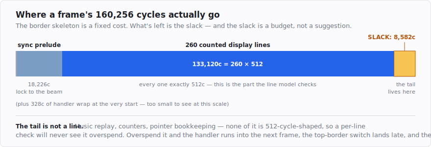

# Sound, slack, and the rest of the frame

By [post 4](post-4-all-four-borders-every-wakestate.md) the borders were open on every wakestate and
the picture didn't tear. Then I added music. Sound is awkward in full-sync code for a specific reason
— its cost isn't constant — and chasing that down forced me to put a number on the one part of the
frame the per-line model never looks at.

<!-- more -->

## Music without a timer

Normally you play music on the ST with an interrupt. A timer fires a fixed number of times per second
— 50, or 200 — and each time, a short **replay** routine runs: it reads the next step of the tune and
pokes the sound chip. The tune's tempo is the timer's rate; the main program doesn't have to think
about it.

Full-sync code can't do that. The whole point of the last few posts is that interrupts are off and
every cycle is accounted for; a timer firing in the middle of the frame would land between two counted
border switches and walk the timing off, exactly like the mouse did in post 2. So the replay has to run
**inline** — called by hand, a fixed number of times per frame, at fixed points in the code. If the
tune wants 50 updates a second, that's one call per frame (there are 50 frames a second); 200 a second
is four calls, spaced evenly down the screen. It's the timer, unrolled into the frame by hand.

Mechanically that looks easy. The replay is just another peg, with cycles reserved for it:

```python
Peg(400, "jsr (a2)", "play", reserve=532)     # a2 -> the replay; keep 532c clear for it
```

`reserve` tells the packer to leave that many cycles empty at the peg rather than pouring effect work
into them. No work goes in the slot; the replay runs there and the line still closes on 512.

The awkward part is the number 532 — where it comes from, and what happens when you go and measure it.

## The wait state that never added up

The sound chip on the ST is the **Yamaha YM2149**: three square-wave voices plus a noise generator.
You play a note by writing its registers — select a register, write a value — and the replay's inner
loop is about as simple as code gets:

```asm
    move.b  (a1)+,d0           ; how many register writes this tick?
    subq.b  #1,d0
    bmi.s   .done              ; zero -> a silent tick, nothing to do
.loop:
    move.b  (a1)+,$ffff8800    ; select a YM2149 register
    move.b  (a1)+,$ffff8802    ; write the value
    dbra    d0,.loop
.done:
```

Two things about that loop make it hostile to a cycle budget.

The first is that I could never get its cost to add up on paper — the measured cost was always higher
than the instructions said. The reason is a wait state: **every access to a YM2149 register costs its
normal cycles plus four.** The chip is slow to talk to and the CPU stalls a little on each poke. Four
cycles doesn't sound like much until you multiply it by a dozen register writes on a busy tick.

The second is worse: look at `d0`. The number of register writes *depends on what the music is doing
this instant*. A tick that starts several notes and runs an effect writes far more registers than a
tick that just lets things ring. So the replay's cost changes from one call to the next — and in
full-sync, a cost that changes is a cost you cannot budget for by averaging. In a normal demo the timer
absorbs the variation; a heavier tick just uses a little more of the time the timer set aside. In
full-sync nothing is set aside for you. Budget for a *typical* tick and the *loud* tick blows the
frame — which shows up as a border that flickers only during the busy bars of the tune, which is a
horrible thing to debug.

So the tool measures the whole tune, tick by tick, in the emulator, and reports the envelope:

```python
from lockstep.sound import profile_play

env = profile_play(PLAY, ticks=len(counts), setup=SETUP, data=make_tune(counts))
print(env.report())
```

```
sound replay: 20 ticks profiled
  per-tick cycles: min 64  typ 116  max 532  (1 tick(s) at worst case)
  => reserve 532c/frame for this peg (worst case, phase-stable)
```

Both problems are in those three numbers. The variance is stark — a silent tick costs 64 cycles, the
loudest 532, an eightfold spread across one short tune. And the wait state is in there too: the
loudest tick writes nine register pairs, so working back, each select-plus-write pair costs about 52
cycles, where the instructions alone say it should be nearer 44. That difference is the YM2149 making
the CPU wait, and it is entirely invisible on paper.

You reserve `env.reserve` — the **worst** tick, rounded up to keep the bus phase stable — every single
frame. Quiet ticks waste a few hundred cycles doing nothing. The loud tick always fits. That's not
really a trade: data-dependent cost is the enemy of sync, and the answer is always to measure the worst
case and reserve it.

## The replay doesn't fit in a line

Except that 532 doesn't fit.

A scanline is 512 cycles, and the border switches and their filler have already spoken for some of it —
a borders-open line has something like 480 cycles genuinely free. The worst tick needs 532. The tool
says so rather than letting me find out on screen:

```
worst case 532c > one line's free space (~480c), so a single 50 Hz mid-frame peg won't
hold it — split into N smaller ticks (100/150/200 Hz = N pegs) or run it in the
post-display slack (Aurora's way).
```

So you have two options. Split the tune into more, smaller ticks and spread them down the frame as
several pegs — or run the replay *after* the picture is drawn, in the stretch of the frame that isn't a
scanline at all. That second one is what my demo does, and it drops us squarely into the part of the
frame this series hasn't looked at yet.

## The part of the frame nobody was counting

Everything so far has been about *lines*: 512 cycles, pegs on their marks, 260 of them in a row. But a
frame is not only its lines. After the last visible line comes the stretch during the vertical blank —
while the beam is flying back up to the top of the screen — where you do the per-frame housekeeping that
*doesn't* have to race the beam: bump counters, advance pointers, and, as we've just decided, run the
music replay. Call it the **tail**.

The tail isn't a scanline, so it falls outside the per-line model completely. The tool will happily
certify every one of my 260 lines at exactly 512 cycles and have nothing whatsoever to say about the
code after them.

That's fine right up until the tail gets fat. The frame is a fixed budget too:



The chain, when you overspend it, is short and mechanical. The VBL handler has to *finish* before the
next frame starts, because the first thing the next frame does is the beam-lock and fine-sync from post
4, and then the top-border switch — all of which has to happen at a precise moment near the top of the
screen. A tail that runs long means the handler finishes late, so the next frame's re-sync starts late,
so its top-border switch lands a few cycles late against the beam — and a few cycles late against the
beam is exactly the wakestate-margin miss from post 2. The top border shuts. Not because any line was
wrong; every line is still a perfect 512.

It happened to me once — I made a per-frame routine about 672 cycles more expensive and the top border
closed, with every static check still green — and the fix is obvious enough once stated: cost the tail
too. So the tool knows all four numbers now. A PAL frame is 160,256 cycles. The border skeleton (the
sync prelude, the 260 counted lines, the handler wrap) eats 151,674 of them. What's left is the
**slack**: 8,582 cycles, and that is what the tail has to live in.

```python
from lockstep.budget import frame_budget

fb = frame_budget(frame, tail=my_tail_code)
print(fb.report())
```

```
frame budget (1040 STF / PAL, 160256c/frame):
  skeleton      151674c  = wrap 328 + prelude 18226 + bands 133120 (260x512)
  slack budget    8582c  (free for the post-display tail)
  => within budget
```

And when you overspend it, it says so at build time, in cycles, before the emulator is ever launched:

```
  tail            9254c  -> -672c free after tail
  !! OVER budget: post-display tail is 9254c but only 8582c of frame slack remains (672c over) —
     the VBL handler overruns the frame and the borders WILL close. Move work into the display
     bands, or cut 672c.
```

There are two more warnings behind that one, and both are lessons from this post rather than new ideas.
If the tail lands *within* a small margin of the slack, it warns that you're in the zone where
wakestate slop can tip you over, and tells you to verify on all four rather than trusting one. And if
the tail cost is *variable* — a sound replay, a conditional bit of churn — it reminds you to reserve
the worst case rather than the average, because the average fits on the cheap frames and closes the
border on the dear one.

That's the whole feature, and it's a small one: the per-line budget and the per-frame budget are the
same idea applied at two scales. It's just that the line budget is the one everybody remembers, because
lines are what the borders are made of, and the frame budget is the one that quietly matters the first
time your tail grows.

**Takeaway:** inline the replay, reserve the worst tick — never the average — and cost the whole frame,
not just its lines. Next, the last post: proving the toolkit by rebuilding a demo I already trusted, and
the short pipeline you'd use to start your own.
